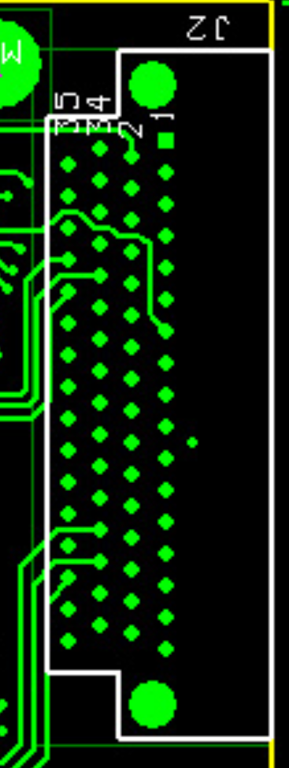

# Meeting 24/03/2023

The HICCE baseline is set as $1.2$ Volts, the output is unsigned, meaning that voltages below baseline is not negative, but full scale (complement 2). Data needs to be converted into `signed`. 

The `Ref` of the HICCE is floating respecting the zedboard, to avoid noice, the ground needs to be connected. Reference of each connector is `pin 33`.

All references have to been grounded, and each "block" is connected into a CB FIFO. 

The data is streamed continously. A header and tail could be implemented to avoid stream misalignment. Also timestamp should be added into the data stream. 

Virtual mode is deprecated, however, it could be usefull an implementation for testing. 

`BW_SEL` Bandwidth set, the value is fixed in version 2.

`READ_MODE` needs to be set in Manual, Auto Sequential is not implemented. 

`Virtual_mode` is deprecated, this could be reimplemented for testing. 

`CON_ALL` is an application specific flag. 